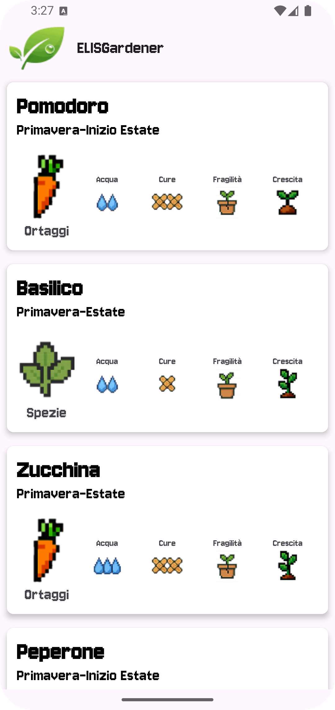
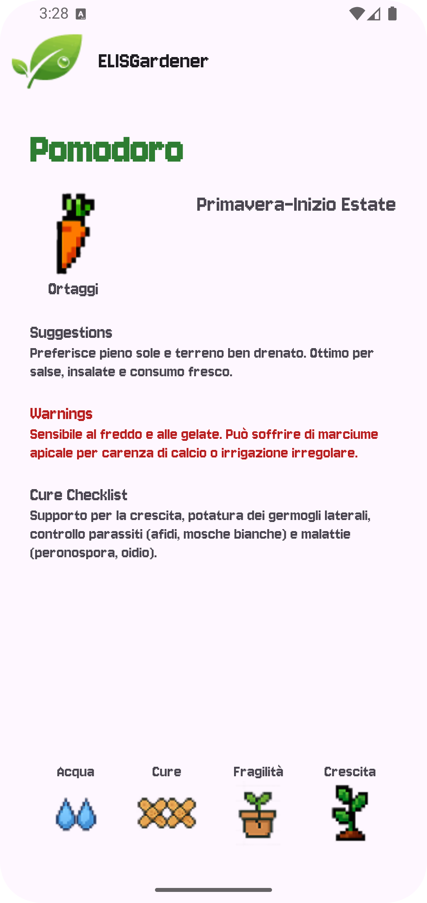
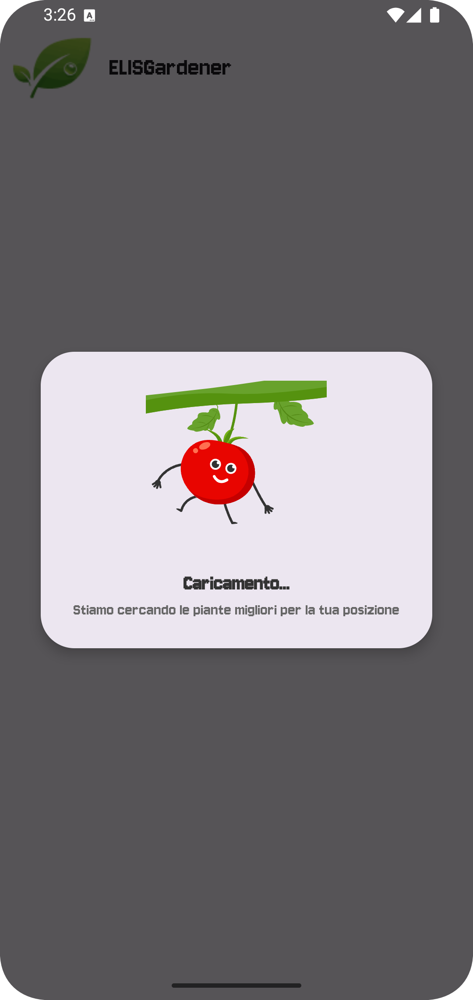

# 🌿 **ELISGardener**

> *Discover what grows where you stand – an Android gardening companion powered by **Gemini AI** through Firebase AI Extensions.*

---

## Table of Contents

1. [Overview](#overview)
2. [Features](#features)
3. [Demo](#demo)
4. [Architecture](#architecture)
5. [Getting Started](#getting-started)
6. [Usage](#usage)
7. [Configuration](#configuration)
8. [Project Structure](#project-structure)
9. [Screenshots](#screenshots)
10. [Roadmap](#roadmap)

---

## Overview

**ELISGardener** is an open‑source Android application that lists plants *most likely to thrive exactly where you are*. It detects the user’s GPS position, queries **Gemini AI** through Firebase AI Extensions and returns a curated catalogue complete with at‑a‑glance vitals and deep‑dive care details.

> **Core idea:** "Show me plants I can actually grow *here* – with zero guesswork."
 

> Why this repo exists: 
> This codebase was originally built as the live demo for an online ELIS webinar on practical Android development with Gemini AI. 
> It now serves as free reference material for attendees and a taste of the hands‑on approach we use in our full Android courses.

---

## Features

- **Location‑Aware Suggestions** – Uses GPS (with user permission) to fetch climate and hardiness‑zone data, filtering plants accordingly.
- **Gemini‑Powered Insights** – `GeminiHelper` prompts Google Gemini (via Firebase) to generate detailed descriptions, warnings (toxicity/allergies) and companion‑plant tips.
- **Simple List UI** – `PlantsAdapter` renders an easy‑to‑scan RecyclerView with icons, sunshine/water badges and difficulty rating.
- **Tap‑for‑Details** – Open `PlantsDetailsActivity` to view growth timeline, best‑practice care, and AI‑generated FAQs.
- **Smooth Permissions** – `PermissionHelper` handles runtime requests for Location & Internet gracefully.

---

## Demo

|                 |                                                                 |
|-----------------|-----------------------------------------------------------------|
| **Slide Deck**  | [`/docs/slides/ELISGardener.pdf`](docs/slides/ELISGardener.pdf) |
| **Screenshots** | See [Screenshots](#screenshots)                                 |

---

## Architecture

```
Activities / UI
│
├─ MainActivity               # Plant list
└─ PlantsDetailsActivity      # Detailed view

Adapters & ViewHolders
├─ PlantsAdapter
└─ PlantsViewHolder

Core Helpers
├─ GeminiHelper      # AI integration via Firebase
├─ LocationHelper    # FusedLocationProvider
└─ PermissionHelper  # Runtime permission flow

Data Models
├─ Plant
└─ PlantsResponse
```

> *Tech Stack*: **Java 17** · XML Layouts · Material Components · **Firebase AI Extensions (Gemini)** · Google Play Services (Location) · Gradle 8 · Android Studio Hedgehog

---

## Getting Started

### Prerequisites

1. **Android Studio Hedgehog** (AGP 8.5+)
2. **Firebase project** with **Gemini AI Extension** enabled
3. **Google Services JSON** (`google-services.json`) placed in `app/`

### Installation

```bash
# Clone repo
$ git clone https://github.com/DevDocentiELIS/ELISGardener.git
$ cd ELISGardener

# Open in Android Studio or build via CLI
$ ./gradlew installDebug
```

---

## Usage

1. Launch **ELISGardener**; grant Location permission when prompted.
2. Wait a moment while `GeminiHelper` fetches plant data based on your coordinates.
3. Browse the list; tap any plant for full care instructions.

---

## Configuration

| File                   | Purpose                                                        |
|------------------------|----------------------------------------------------------------|
| `google-services.json` | Connects the app to your Firebase project.                     |
| `local.properties`     | Optional: override `FIREBASE_API_KEY=` or other build secrets. |

> **Tip:** Adjust prompt templates in `GeminiHelper.java` to fine‑tune AI responses.

---

## Project Structure

```
app/
 ├─ java/com/example/elisgardener/
 │   ├─ ui/
 │   │   ├─ MainActivity.java
 │   │   └─ PlantsDetailsActivity.java
 │   ├─ adapters/
 │   │   ├─ PlantsAdapter.java
 │   │   └─ PlantsViewHolder.java
 │   ├─ helpers/
 │   │   ├─ GeminiHelper.java
 │   │   ├─ LocationHelper.java
 │   │   └─ PermissionHelper.java
 │   ├─ models/
 │   │   ├─ Plant.java
 │   │   └─ PlantsResponse.java
 │   └─ utils/
 │       └─ LoadingDialog.java
 └─ res/
     ├─ layout/    # XML files
     └─ drawable/  # Icons & images
```

---

## Screenshots

| Home (List)               | Plant Details                | Loading dialog                     |
|---------------------------|------------------------------|------------------------------------|
|  |  |  |


---

## Roadmap

* [ ] Watering reminders & calendar export
* [ ] Camera‑based disease identifier
* [ ] Multi‑language support (EN/IT first)
* [ ] Companion‑planting “garden planner” grid


